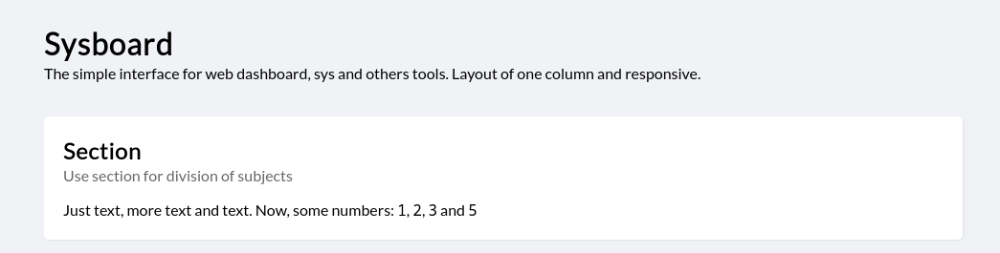
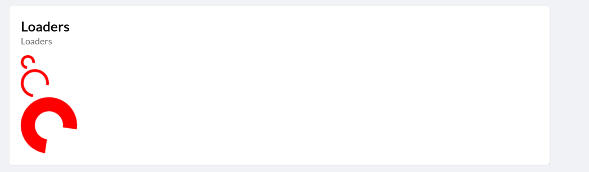
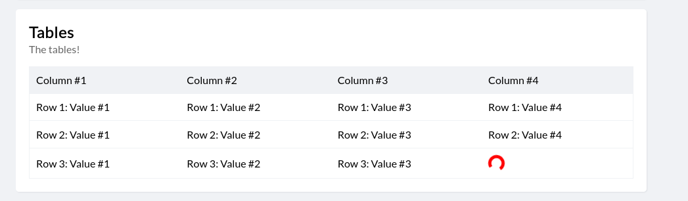
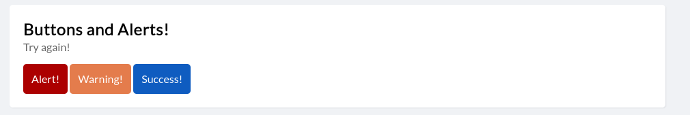
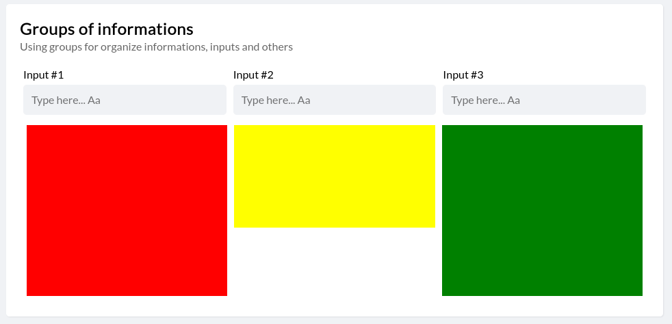

# Sysboard
Interface for prototypes of systems or applications that need to be built at
the speed of light.

## Topics
1. How to install Sysboard in my project
2. How to use?
3. Sections
4. Chargers
5. Tables
6. Buttons
7. Inputs
8. Grouping of information
9. Notifications
10. How to contribute

## How to install Sysboard in my project
Besides being light and simple, its installation is quick. Basically, you must
download the project files and start mentioning an HTML file. The basic
structure for the project is:

```html
<main>
  <header>
    <h1>My Project</h1>
    <p>My subtitle for project</p>
  </header>
  <section></section>
</main>
```

In every section, you can add header too:
```html
<main>
  <section>
    <header>
      <h1>My Section</h1>
      <p>Subtitle for my section</p>
    </header>
  </section>
</main>
```


Of course, you do not need to lock in the structure, it can expand according
to your needs.

## How to use?
The interface divisions are important concepts that you should learn and
understand. The interface is all modularized through "sections" HTML elements.
Where will your interface components go, for example; buttons, lists, inputs. 
The following sections may contain a head to display some important
information, for example:

```html
<main>
  <header>
    <h1>Sysboard</h1>
    <p>The simple interface for web dashboard, sys and others tools. Layout of one column and responsive.</p>
  </header>
  <section>
    <header>
      <h1>Section</h1>
      <p>Use section for division of subjects</p>
    </header>
    <div>
      Just text, more text and text. Now, some numbers: <code>1</code>, <code>2</code>, <code>3</code> and <code>5</code>
    </div>
  </section>
</main>
```



## Loaders
Eventually, it is important that the user views a loader to understand what a process is happening in the background. Um load of dice. For this, you can use the prompt class:

```html
<div class="loader loader-small spinner-default"></div>
```

You can style according to your preferences. Use as classes for medium or large to alter the size of the loader:

```html
<div class="loader loader-small spinner-default"></div>
<div class="loader loader-medium spinner-default"></div>
<div class="loader loader-large spinner-default"></div>
```




## Tables
These tables are powerful ways to display dice. For this reason, it will not work outside the interface, use isso to display a list

```html
<table>
  <thead>
    <tr>
      <td>Column #1</td>
      <td>Column #2</td>
      <td>Column #3</td>
      <td>Column #4</td>
    </tr>
  </thead>
  <tbody>
    <tr>
      <td>Row 1: Value #1</td>
      <td>Row 1: Value #2</td>
      <td>Row 1: Value #3</td>
      <td>Row 1: Value #4</td>
    </tr>
    <tr>
      <td>Row 2: Value #1</td>
      <td>Row 2: Value #2</td>
      <td>Row 2: Value #3</td>
      <td>Row 2: Value #4</td>
    </tr>
    <tr>
      <td>Row 3: Value #1</td>
      <td>Row 3: Value #2</td>
      <td>Row 3: Value #3</td>
      <td><div class="loader loader-small spinner-default"></div></td>
    </tr>
  </tbody>
</table>
```



## Buttons
You can declare buttons in these ways:

```html
<div>
  <button class="btn-alert">Alert!</button>
  <button class="btn-warning">Warning!</button>
  <button class="btn-success">Success!</button>
</div>
```



## Inputs
To capture user input, you do not need to:

```html
<input type="text" name="example" placeholder="Type something..." />
```

## Information group
If necessary, you will be able to information group. We are going to use inputs as an example, but you can use whatever you want.

```html
<div class="group group-space-input">
  <div class="group-div"></div>
  <div class="group-div"></div>
  <div class="group-div"></div>
</div>
```

You can divide the groups which way you prefer.



## How to contribute
It is very important to your contribution. If you have new ideas, or just want to correct any errors found in the project, be sure to make the modifications and send a pull request.

If you need more examples, use the repository examples. Here are some examples for using the interface.

This document was translated from Portuguese to English. Please, if you find any translation errors, open an issue.